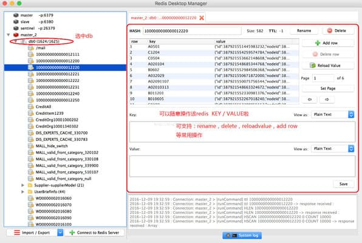
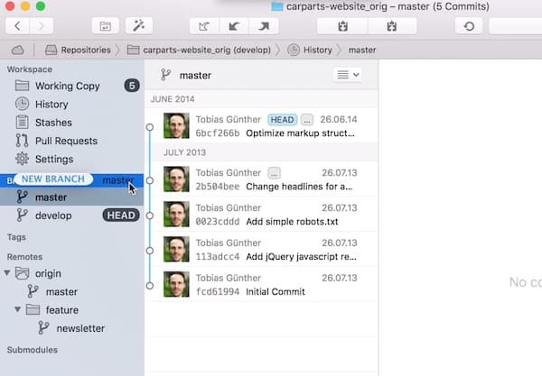
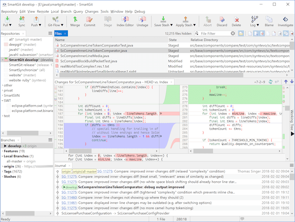
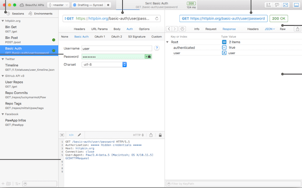
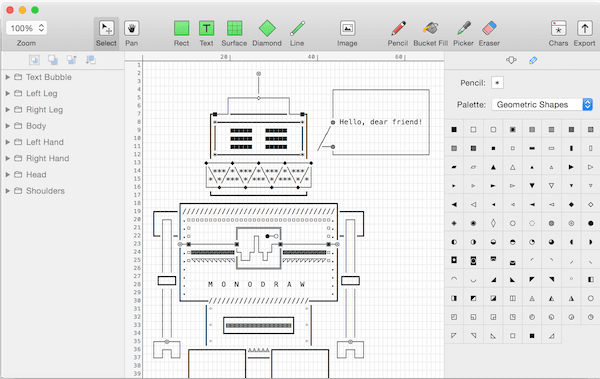
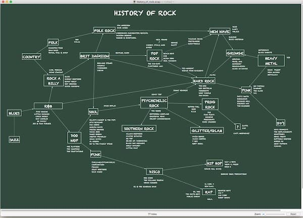

# 开发类 Apps

## 目录

[toc]

## Code 编码
### CodeRunner

CodeRunner3 mac破解版是Mac系统下的一款编程软件，支持23种语言和.txt文档制作，比Xcode都强大，Xcode只支持4种语言，原来的破解补丁有联网验证的问题，现在我做了程序防止联网验证。新版CodeRunner 3 Mac 版本支持深色模式以及其他大量新的特性，CodeRunner 是一款多语言编程开发工具，方便学习者快速的运行示例代码，不用浪费大量时间进行开发环境的搭建，他虽然不如专业的IDE功能强大，但支持多种语言，如Swift, AppleScript, C, C++, Java, JavaScript (Node.js), Lua, Objective-C, Perl, PHP, Python, Ruby, Shell 等，我们用它进行代码演示、代码测试等，简单快速，不需要安装各种环境，非常好用！

### PPRows 开源
GitHub：https://github.com/jkpang/PPRows/blob/master/README_CN.md

在 Mac 上计算你写了多少行代码：

- 支持检测参与计算的代码文件夹数量以及代码行数；
- 支持同时检测多文件 / 多文件夹代码；
- 支持自定义检测的文件类型，例如: C，Swift，OC，Java... 类型的代码文件；
- 支持自定义需要忽略检测的文件夹, 例如: iOS 工程中的 Pods 文件夹；
- 支持中文与英文，跟随系统语言变化 (v1.1.0 起支持)；
- 支持忽略代码中的空行，代码行数计算更精确(v1.2.0 起支持)。

## 正则表达式
### 1、Patterns

Patterns Mac版是一款macOS平台的正则表达式工具，使用正则表达式。Patterns Mac版包括一个内置备忘单,可供复习使用，在编辑时可以即时匹配和替换。快速使用在多种不同的编程语言匹配和替换代码片段。内置的正则表达式引用表可以帮助你找到所需的正则表达式语法

## 数据库
### 1、Navicat Premium 中文版 `12.1.23`
[**下载地址**](https://dev.tencent.com/u/ChenJie1219/p/MacApps/git/raw/master/APP/Navicat%20Premium.zip)

Navicat Premium 是最优秀的数据库图形化管理客户端，支持MySQL、SQL Server、SQLite、Oracle 和 PostgreSQL 等数据库，支持数据库建模，正向和反向工程，数据同步等功能，而Premium版本是包含了Navicat所有功能的最强大版本，是首选的数据库客户端工具！

### 2、Redis Desktop Manager

Redis Desktop Manager是一款好用的Redis桌面管理工具，支持命令控制台操作，以及常用，查询key，rename，delete等操作。支持跨平台的 Redis DB管理工具，基于Qt 5开发，支持SSL / TLS加密，SSH隧道和cloud Redis。

### 3、Studio 3T

Studio 3T 是来自国外的一款简单实用，功能强大的MongoDB数据库GUI连接工具。它是MongoDB的专业GUI和IDE，支持加快查询构建，数据探索，导入/导出，代码生成等任务，操作简单，入门门槛较低，无论是否具有MongoDB查询语言的知识。Studio 3T已经帮助成千上万的MongoDB开发人员和管理员完成日常工作，超过100,000名开发人员和管理员使用Studio 3T作为MongoDB的首选管理GUI。

### DbWrench

DbWrench 工具等价于powerdesigner 均为数据库原型设计工具，DbWrench 是一个数据库设计和同步软件，为数据库开发人员提升生产率，可轻松的创建和修改数据库。

主要特性：
- 图形化的 ERD 图形设计器
- 将设计的模型生成实际的数据库建库 SQL 脚本
- 可从已有数据库中反向工程为设计模型
- 内建 SQL 语法高亮的查询编辑器
- 支持 Windows, Mac OSX and Linux 

### Navicat Data Modeler

Navicat Data Modeler 是一个强大的和符合成本效益的数据库设计工具，它能帮助用户创建高质素的概念、逻辑和物理数据模型。让你可视化地设计数据库结构、执行逆向或正向工程程序、从 ODBC 数据源导入模型、生成复杂的 SQL/DDL 和打印模型到文件等。

只需点击一下，便能简化创建复杂实体关系模型和生成 SQL 脚本的工序。Navicat Data Modeler 支持各种数据库系统，包括 MySQL、MariaDB、Oracle、SQL Server、PostgreSQL 和 SQLite。

使用专业的对象设计器创建、修改和设计你的模型，适用于表和视图。无需编写复杂的 SQL 来创建和编辑对象，你会知道你正使用什么选项。此外，Navicat Data Modeler 支持三种标准的符号：Crow’s Foot、IDEF1x 和 UML。功能丰富、操作简单、用户友好的绘图工具，让你只需点击几下就能创建一个完整的数据模型。

Navicat Data Modeler 使你能够为各种各样的人构建高品质的概念、逻辑和物理数据模型。使用模型转换功能，你可以将一个概念业务级别的模型转换为逻辑关联数据库模型，然后转换为物理数据库。从草拟你的系统设计大纲，到查看关系和设置链接的实体、表和视图的属性和字段。你可以轻松地配置精确的改变到数据库结构，并创建有组织和更有效的数据库系统。

### DataGrip

DataGrip 2019破解版是JetBrains带来的专业的数据库ide工具，专为满足专业SQL开发人员的特定需求而量身定制。 DataGrip 2019 允许您以不同模式执行查询，并提供本地历史记录，可跟踪您的所有活动并保护您免于丢失工作。 DataGrip 2019允许您通过相应的操作按名称跳转到任何表，视图或过程，或直接从SQL代码中的用法跳转到任何表，视图或过程。使您可以深入了解查询的工作方式和数据库引擎行为，从而提高查询效率。

## 版本管理
### 1、SourceTree - 强大的 Git 跨平台客户端

SourceTree 是 Windows 和Mac OS X 下免费的 Git 和 Hg 客户端管理工具，同时也是Mercurial和Subversion版本控制系统工具。支持创建、克隆、提交、push、pull 和合并等操作。

SourceTree拥有一个精美简洁的界面，大大简化了开发者与代码库之间的Git操作方式，这对于那些不熟悉Git命令的开发者来说非常实用。

### 2、Fork - 一个快速友好的 Git 客户端

Fork Mac版是一款Mac平台上的Git客户端软件，相信很多程序员朋友对各种Git客户端工具都很熟悉，Fork Mac版就是其中一款，Fork Mac版拥有非常简洁、友好的用户界面，

### 3、Tower2 - 最强大的 Git 客户端。

Tower for Mac是一款简单易用的Git客户端，使得使用Git变得简单而高效。用户可以从其优雅而全面的界面中受益，并且可以让用户享受Git的全部功能。界面将Git的复杂性抽象化。例如，只需通过拖放即可执行大量的操作，并且可以轻松地解决错误。高级用户可以通过单行登台，子模块支持或文件历史记录等功能提高工作效率。

### 4、SmartGit - 非商业用途免费，全平台支持，集成 Github 服务。

SmartGit Mac破解版是一款图形化的gif客户端工具，软件拥有直观可视化的操作界面环境，只需要简单地配置便可以实现Git 及 Mercurial的版本控制操作，支持与流行的平台兼容，带有GitHub、BitBucket和Atlassian Stash的特殊集成，配置完成后就可以进行文件的管理了，

#### 5、GitKraken - 最流行的图形用户界面的 git 管理工具。

一款彻头彻尾的豪华Git客户端，支持Windows，Mac和Linux平台。对个人用户、开源项目，教育用户以及小型创业公司用户免费。

gitkraken中文版是一款基于Electron构建的灵活实用的git图像化工具。gitkraken主要为程序员们提供了一个强大专业的git操作平台，软件界面清爽简洁，拥有直观易懂的功能模板，能够提供GitHub企业集成、GitLab CE和EE集成、本地账户管理和应用冲突输出编辑器等应用功能，同时还可以实现与Git托管服务无缝集成。

## 文档管理
### Dash `4.6.3`
[**下载地址**](https://dev.tencent.com/u/ChenJie1219/p/MacApps/git/raw/master/APP/Dash.zip)

Dash 是使用与Mac OS平台的软件编程文档管理工具，可以浏览API文档，以及管理代码片段工具。Dash自带了丰富的API文档，涉及各种主流的编程语言和框架。 Dash内置了丰富的API文档，让我们集中管理API文档，包括下载、搜索、查阅并支持集成到XCode、Alfred等软件中，非常的强大！

## Host 修改
### 1、SwitchHosts

SwitchHosts是一个管理、快速切换Hosts小工具，开源软件，一键切换Hosts配置，非常实用，高效。

## 反编译
### 1、Hopper Disassembler
[**下载地址**](https://dev.tencent.com/u/ChenJie1219/p/MacApps/git/raw/master/APP/Hopper%20Disassembler%20v4.dmg)

Hopper Disassembler 是一款Mac上强大的二进制反编译工具，可让您对应用程序进行反汇编，反编译和调试。

### 2、JD-GUI

JD-Core 是一个免费的库，从一个或多个“.class”文件中 重构Java源代码。JD-Core可以用来恢复丢失的源代码，并深究Java运行时类库。支持Java 5的功能：如注释，泛型或枚举 。JD-GUI 和 JD-Eclipse都包括JD-Core。

JD-GUI 是一个独立的显示“.class” 文件Java源代码的图形用户界面工具。您可以使用JD-GUI浏览和重建源代码的即时访问方法和字段，以代码高度方式来显示反编译过来的代码。

## 网络分析、API开发和分析

### 1、Wireshark

### 2、Charles `4.2.8`
[**下载地址**](https://dev.tencent.com/u/ChenJie1219/p/MacApps/git/raw/master/APP/Charles.zip)

Charles 是一款Mac上的HTTP代理服务器、HTTP监视器、反向代理服务器，可以让开发者监视查看所有连接互联网的HTTP通信，包括请求，响应和HTTP头信息等等，俗称“抓包”工具，对于Web开发人员来说是一款很有价值的辅助工具！

## HTTP请求
### 1、PostMan

Postman 提供功能强大的 Web API 和 HTTP 请求的调试，它能够发送任何类型的HTTP 请求 (GET, POST, PUT, DELETE…)，并且能附带任何数量的参数和 Headers。不仅如此，它还提供测试数据和环境配置数据的导入导出，付费的 Post Cloud 用户还能够创建自己的 Team Library 用来团队协作式的测试，并能够将自己的测试收藏夹和用例数据分享给团队。

### 2、Paw

Paw HTTP Client mac版是一款Mac上的HTTP客户端模拟测试工具，可以让Web开发者设置各种请求Header和参数，模拟发送HTTP请求，测试响应数据，支持OAuth, HTTP Basic Auth, Cookies等，这对于开发Web服务的应用很有帮助，非常实用的一款Web开发辅助工具。

### 3、HTTPie 网络请求工具

HTTPie (发音是 aitch-tee-tee-pie) 是一个 HTTP 命令行客户端。它能通过命令行界面与 Web 服务进行交互。它提供一个简单的 http 命令，允许使用简单而自然的语法发送任意的 HTTP 请求，并会显示彩色的输出。HTTPie 能用于测试、调试及与 HTTP 服务器交互。
- 具表达力的和直观语法
- 格式化的及彩色化的终端输出
- 内置 JSON 支持
- 表单和文件上传
- HTTPS、代理和认证
- 任意请求数据
- 自定义头部
- 持久化会话
- 类似 wget 的下载
- 支持 Python 2.7 和 3.x

## 比较工具
### 1、Beyond Compare `4.2.10`
[**下载地址**](https://dev.tencent.com/u/ChenJie1219/p/MacApps/git/raw/master/APP/Beyond%20Compare.zip)

Beyond Compare这是一款号称码农神器的软件，Beyond Compare能够在Mac OS系统上非常专业的对比两个文件或者两个文件夹的不同之处，并把每一个不同之处以不同的颜色加以区分，你可以很清楚很明显的了解到两个相似文件的不同支持，便于开发者们和设计人员工作之用。

## FTP

### FileZilla

FileZilla for Mac是一个免费开源且跨平台的FTP解决方案的Mac OS平台版本，分为客户端版本和服务器版本，具备所有的FTP软件功能。软件许可证为GPL。可控性、有条理的界面和管理多站点的简化方式使得Filezilla客户端版成为一个方便高效的FTP客户端工具，而FileZilla Server则是一个小巧并且可靠的支持FTP SFTP的FTP服务器软件。

### Transmit `5.5.1`
[**下载地址**](https://dev.tencent.com/u/ChenJie1219/p/MacApps/git/raw/master/APP/Transmit.zip)

Transmit 是一款 Mac 上的 FTP 客户端，无论在界面还是用户体验上做的都很好，支持连接历史记录、喜爱列表、双栏浏览、连接为本地磁盘等，除了FTP协议外，还支持SFTP、亚马逊的S3、WebDAV等协议，连接和文件传输速度都很快，非常不错, Mac 上首选的 FTP 客户端！

## 设计
### 1、IconFly `3.9.1`
[**下载地址**](https://dev.tencent.com/u/ChenJie1219/p/MacApps/git/raw/master/APP/IconFly.zip)

IconFly 是一个令人难以置信的节省时间，让您可以轻松地在多种格式为你的Mac，iPhone，iPad和Apple关注应用程序创建的图标。此外，IconFly允许您为Android应用程序以及Web剪辑图标和图标创建图标。IconFly得到了积极支持并不断更新。
支持图标创建的图像格式：PNG，JPEG，TIFF，GIF，ICNS，PSD，EPS，AI，PDF。

### 2、Icons8 `5.6.7`
[**下载地址**](https://dev.tencent.com/u/ChenJie1219/p/MacApps/git/raw/master/APP/Icons8.zip)

Icons for mac是一款运行在macOS平台上的图标素材软件。这款软件中有70000+个图标供您搜索。可以帮助用户轻松找到需要查找的图标，使用非常方便。

### 3、Sketch `55.2`
[**下载地址**](https://dev.tencent.com/u/ChenJie1219/p/MacApps/git/raw/master/APP/Sketch.zip)

Sketch 是一款Mac上小巧但功能强大的矢量绘图软件，最新版本，增加了大量新的功能，尤其是Sketch Mirror，相比其他的矢量绘图软件，比如AI，Sketch的优点在于使用简单，学习曲线低，让我们能够用Sketch快速的绘制图形，可以说是轻量级的 AI，Sketch 提供了基本的形状，支持自动切图，PDF、EPS、SVG等格式文件的导入和导出，并且增加了移动设计模板，非常适合进行网站设计。

Sketch Cache Cleaner：清理 Sketch 历史文件，释放磁盘空间，github：https://github.com/yo-op/sketchcachecleaner/releases

### 4、Sip `1.1.5`
[**下载地址**](https://dev.tencent.com/u/ChenJie1219/p/MacApps/git/raw/master/APP/Sip.zip)

Sip 是一款设计师和前端应该会需要的屏幕取色软件，你只需要鼠标点一下即可取得屏幕当前位置的颜色值，并将数据自动存到剪切板，方便随时粘贴出来。支持 CSS、UIColor 等多种格式。

### 5、Goldie App `1.3.1`
[**下载地址**](https://dev.tencent.com/u/ChenJie1219/p/MacApps/git/raw/master/APP/Goldie%20App.zip)

Goldie App 是mac上一款非常强大的黄金比例设计工具，Goldie App体积小巧，可以驻留在系统的菜单栏之上，随时提供给用户调用。而且拥有独特的计算功能，可以帮助你在任何需要的时候获得精确的黄金比例。还有先进的设置和美丽的黑暗模式可以选择，非常好用！

### 6、Axure RP `9.0.0.3650`
[**下载地址**](https://dev.tencent.com/u/ChenJie1219/p/MacApps/git/raw/master/APP/Axure%20RP%209.zip)

Axure RP是最知名和最强大的专业的快速原型设计工具，让负责定义需求和规格、设计功能和界面的专家能够快速创建应用软件或Web网站的线框图、流程图、原型和规格说明文档。

### 7、Creo `2.0.6`
[**下载地址**](https://dev.tencent.com/u/ChenJie1219/p/MacApps/git/raw/master/APP/Creo.zip)

Creo for Mac开发工具，移动应用，集成了支持设计的用户界面和编写权力效用。旨在移动应用程序的开发工具的代码将设计和编码相关的任务置于同一屋檐下。该实用程序使您可以创建和自定义应用程序的布局，同时还提供对基于对象的编程的支持。

### 8、Monodraw 非常好用的一款ASCII码设计编辑工具

Monodraw mac是Mac端非常好用的一款ASCII码设计编辑工具，是一个文本图像编辑器，可以用它创建基于文本的艺术图以及流程图等。monodraw mac破解版能够直观的表示算法、数据结构以及ASCII二进制格式，它的特色就在于只是文本图像，所以可以任意的拷贝到TXT编辑器、电子邮件等等不能直接插入图片的环境中。甚至在一些无法显示图片的终端，如打字机、电传打字机等设备上，非常的强大。

### 9、Art Text 生成各种特效字体

Art Text是专为字体，排版，文本模型和各种艺术文字效果而调整的图形设计软件。提供各种随时可用的样式和材料，纹理，图标，字体和背景的选择，特殊设计的效果和形状转换，Art Text保证徽章，徽标，卡片，传单和演示文稿的醒目外观。专业设计师和业余爱好者都会惊叹于创造复杂效果的特别容易，例如真实的3D文字，上面有任何天然材料 - 木头，铁锈，碎玻璃，甚至巧克力，柔和的阴影和光晕，油画或水彩画的图形，老年人和摇滚风格等等。

### 10、GifCapture 开源 macOS 截屏生成 Gif 工具

这是一款macOS平台的GIF动画录制工具，可以帮助我们在Mac电脑上非常方便地录制GIF动画，自由设定画面录制大小和范围，操作简单方便。

### 11、Gifox for Mac 专业的高颜值 GIF 录制应用

Gifox破解版是知您网搜集到的Mac os系统上一款MGif动画制作软件，Gifox的功能操作及录制效果都还不错，在图片质量和大小上控制得也算OK。对于绝大多数情况下的使用都足够。对于长期需要录制GIF的用户来说还是值得入手的。

### 12、Snip 简单高效的截图工具，腾讯作品

snip for mac是一款mac滚动截图软件，腾讯snip使用时可截取指定区域、固定窗口区域,截取后可进行拖拉缩放,snip支持添加矩形、椭圆、箭头、画刷、文字等多种标记,snip支持保存到本地和复制到剪贴板。

### 13、截图(Jietu) 截图附带强大的标注功能，腾讯作品

截图(Jietu)-快速标注、便捷分享的截屏工具 轻松便捷的截图软件截图（Jietu）是一款免费应用，精美界面设计，操作简单，功能强大。 

### 14、Image2icon 将你的图片转换成图标

Image2icon是一款Mac平台上全新的图标制作软件，用它可以创建你自己的Mac图标，并自定义文件和文件夹的icon图标。如果你厌倦了一沉不变的icon，那就下载这款Image2icon，给你的mac和其它设备换上你喜欢的icon吧！

### 15、ImageAlpha 压缩 PNG 图片，去掉无效的透明。

通过应用有损压缩和转换为更高效的PNG8 + alpha格式，mageAlpha大大减少了24位PNG文件的文件大小（包括alpha透明度）。这些图像与iOS，所有浏览器兼容，甚至在IE6中降级。

通过使用最新的pngquant和pngnq-s9以及Alpha通道感知后处理器，ImageAlpha可以在MacromediaAdobe Fireworks中获得比类似功能更好的质量。

### 16、ImageOptim 压缩图片，删除 EXIF 信息

ImageOptim 是一款非常简单的图片大小优化工具。只要拖动图片到软件界面就可以自动把图片的大小进行优化。ImageOptim Mac版对于开发人员和设计人员一定还有用处，如文件的EXIF标签和颜色配置文件等，达到优化减小占用磁盘空间。

### 17、JPEGmini 将图像尺寸降低高达 80％，而不会影响质量

一种能够优化JPEG压缩的方法。该方法预计可以将照片体积缩小50%-80%。只能通过ICTV提供的在线方式使用,经过 JPEGmini 压缩后的图片可以使分享更加容易，既提高分享速度，又节省带宽和流量。

以色列科技公司ICTV最新开发出一种能够优化JPEG压缩的方法。该公司的JPEGmini系统会自动分析一张照片在对画质不产生可见损失前提下可用的最大压缩率。ICTV称该方法预计可以将照片体积缩小50%-80%。

目前，JPEGmini系统只能通过ICTV提供的在线方式使用。用户可以上传照片，由系统进行优化压缩。本文开头的那张照片原始大小为6195K，经JPEGmini系统优化后大小为1024K。根据 JPEGmini，他们的技术通过一种独特的模仿人类视觉的系统来分析输入图片，基于这个分析算法，它可以最大化压缩，但是不引起视觉变化。系统还包含一个 JPEG 编码器，使压缩后的图片仍然遵循 JPEG 标准。所以，JPEGmini 并没有创造一个新的格式。

目前 JPEGmini 只提供 Web 服务方式，用户上传图片，系统自动将图片压缩，如果只上传一张图片，用户并不需要注册帐户，如果需要处理多张，则需要注册帐户（免费）。

### 18、马克鳗 - 高效的设计稿标注、测量工具

MarkMan官方版是基于AdobeAIR平台的方便高效的标注工具，既有爱又给力的长度标注神器，设计师、重构、前端工程师必备，可方便地为设计稿添加标记，极大节省设计师在设计稿上添加和修改标注的时间，MarkMan官方版是一款操作简单方便，使用起来快捷、迅速，拥有很高的效率，让无聊的工作充满乐趣的软件!

### 19、iPic - Markdown 图床、文件上传工具

有了图床神器 iPic，不论屏幕截图、还是复制图片，都可以自动上传、保存 Markdown 格式的链接，直接粘贴插入，够懒人吧？

使用 Hexo | Heroku 或 WordPress 写博客、在公众号发文章、在知乎讨论、在豆瓣灌水、在论坛发帖、跨境做外贸电商 …

iPic 带给你从未有过的插图体验。当然，除了图片，你可以 上传普通文件，上传方式与图片完全相同。

### 20、PicGo - 支持常用 cdn 的图床工具

所谓图床工具，就是自动把本地图片转换成链接的一款工具，网络上有很多图床工具，就目前使用种类而言，PicGo 算得上一款比较优秀的图床工具。它是一款用 Electron-vue 开发的软件，可以支持微博，七牛云，腾讯云COS，又拍云，GitHub，阿里云OSS，SM.MS，imgur 等8种常用图床，功能强大，简单易用。

### 21、Assetizr - 图片编辑应用，轻松更改图片尺寸，压缩图片，重命名图片

Assetizr是一款好用的图片处理软件，包括调整图片大小、重命名、无损压缩等功能，采用无损压缩技术，在保证画质不变的情况下最大幅度的减少图片容量，支持JPG、PNG、SVG、GIF和WEBP等常见格式。

## 画图工具
### 1、XMind ZEN `9.2.1`
[**下载地址**](https://dev.tencent.com/u/ChenJie1219/p/MacApps/git/raw/master/APP/XMind%20ZEN.zip)

XMind ZEN 是一款全新的思维导图软件，也是Xmind新出的产品。Xmind ZEN采用全新的内核，拥有经典Xmind操作体验，完美坐到一种全新却不失经典的体验，界面简洁，上手容易操作简单。

### 2、Margin Note `3.3.6007`
[**下载地址**](https://dev.tencent.com/u/ChenJie1219/p/MacApps/git/raw/master/APP/MarginNote.zip)

MarginNote 是一款Mac上功能强大的阅读和学习工具软件，它将PDF/EPUB阅读器和多种学习工具集成起来，使得学习者可以在学习时从不同的维度将知识进行重组，连接，从而达到记住，领会的效果，很不错的一款阅读学习工具！

### 3、StartUML UML工具

StarUML 是一款开放源码的 UML 开发工具，可绘制9款UML图：用例图、类图、序列图、状态图、活动图、通信图、模块图、部署图以及复合结构图等。 例如，可设计关于银行金融卡业务的 UseCase 图或是关于可乐贩卖机的实时控制系统的 UseCase图。

StarUML 2，跨平台支持，支持 UML 2.x、ERD 实体关系图、快速建模、视网膜显示屏支持、扩展（插件）管理、模型驱动开发、代码工程、开放 APIs、异步模型验证、HTML 文档导出、PDF、Markdown。

### 4、OmniGraffle Pro

OmniGraffle是由The Omni Group制作的一款绘图软件，其只能于运行在Mac OS X和iPad平台之上。它曾获得2002年的苹果设计奖。

OmniGraffle可以用来绘制图表，流程图，组织结构图以及插图，也可以用来组织头脑中思考的信息，组织头脑风暴的结果，绘制心智图，作为样式管理器，或设计网页或PDF文档的原型。
它具有采用拖放的所见即所得界面。所谓的"Stencils"—一组用于拖放的形状—可以作为OmniGraffle的插件使用，用户也可以创建自定义的Stencils。

### OmniFocus

OmniFocus Mac版这是一款IOS 和Mac平台上最强大的书籍与事务管理方法“Getting Things Done”工具，你可以有条理有逻辑的安排好你的工作和生活。主要协助您捕捉并管理各项事务与点子，发挥生产力；您可以用它来储存、管理及处理各项动作或任务，而任务或各项目可被指派到相关的专案中，同时OmniFocus也提供了视觉提示来提醒您下一步该执行的动作。

### Scapple 优秀的思维导图草图工具

Scapple是Mac 平台上一款能够完美替代纸上Brainstorm的实用小工具。只需双击，即可创建字数不限的Notes，这些Notes之间可以用直线连接，也可以随意排列，适用于团队项目讨论以及软件开发设计等诸多工作。

Scapple是我如何在纸上处理我的粗略想法的软件。当我在任何项目的早期阶段,无论是写作项目或软件项目中,我倾向于把一堆点子一大张纸,阻断了尚未无关的想法,集群相关的笔记,和绘画之间的联系,试图找出如何一切都适合在一起。简而言之，Scapple是一种工具，可以让早期的想法尽快得到解决，并在它们之间建立联系。这样做的主要优势在粗加整修而不是在纸上是你不要的纸(粗加整修画布扩展以适应您想创建尽可能多的笔记),你可以移动的笔记,为新的想法和连接,很容易删除和编辑笔记,笔记导出到其他应用程序很容易当你知道你想做什么。

## IOS 开发
### 1、Reveal `21`
[**下载地址**](https://dev.tencent.com/u/ChenJie1219/p/MacApps/git/raw/master/APP/Reveal.dmg)

Reveal 是Mac 平台上的一款开发者调试IOS应用的Mac开发软件，它能够在运行时调试和修改iOS应用程序。Reveal能连接到应用程序，并允许开发者编辑各种用户界面参数，这反过来会立即反应在程序的UI上。

### 2、FlawlessApp `0.9.9`
[**下载地址**](https://dev.tencent.com/u/ChenJie1219/p/MacApps/git/raw/master/APP/FlawlessApp.zip)

FlawlessApp 是一款专为UI设计师及开发者打造的一款UI原型矫正工具。可以让你的iOS应用看起来与预期设计完全一样。通过实时比较所有内置于iOS模拟器的预期和实施设计。我们为那些痴迷于移动应用程序质量的人们打造了无瑕疵。

**选择设计文件**

只需从界面中选择一个设计，或将&拖放文件拖到菜单栏中的无瑕应用程序图标Live Home 3D上。您可以选择一种或多种不同格式的设计：草图，jpeg，png，tiff或gif。

**选择比较模式**

选择设计文件后，它将出现在iOS模拟器上。您可以使用叠加或拆分比较模式来查看预期设计和CADintosh X实现之间的任何视觉差异。Flawless App支持纵向和横向屏幕的比较，因此您可以逐像素地检查每个设计的质量。

### 3、iMazing `2.9.13`
[**下载地址**](https://dev.tencent.com/u/ChenJie1219/p/MacApps/git/raw/master/APP/iMazing.zip)

iMazing 是一款Mac上优秀的 iOS 设备管理工具，功能与 iTools Pro 一样，可以让我们方便管理iOS设备的短信、联系人、照片、视频、音乐等等，方便在Mac和iOS设备间导入导出文件，支持最新的 iPhone  和 iOS  系统，界面也很漂亮！

