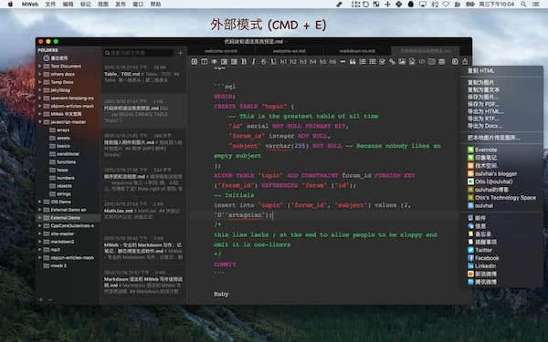
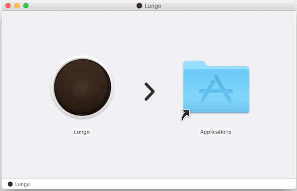
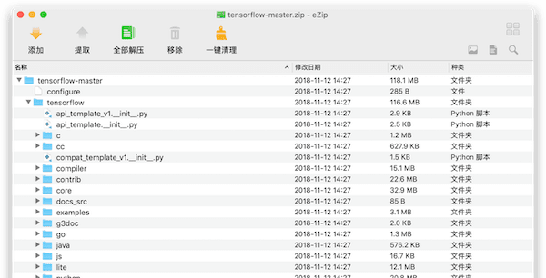
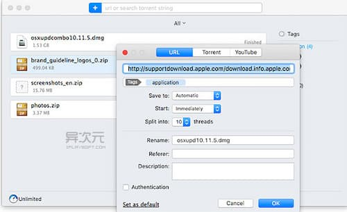
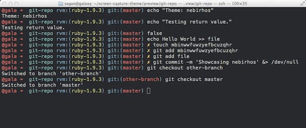

# 日常使用 App

## 目录

[toc]

## 视频播放
### 1、Elmedia Player Pro Mac 万能视频播放器

Elmedia Player一款适用于Mac的多功能媒体播放器，支持广泛的常见和不常见的音频和视频格式，包括FLV，SWF，WMV，AVI，MOV，MP4，MP3，DAT，FLAC，M4V，MPG，MKV和更多。它可以播放您Mac上几乎所有的媒体文件。此播放器还拥有一些方便的功能，如内置的网络浏览器和开放网址选项，可让您从应用程序窗口观看在线视频。

## 广告拦截
### 1、AdGuard `2.0.6`

Adguard 是一款功能强大的广告和弹出窗口拦截工具。它适用于所有安装的浏览器，如Firefox、Opera等，有效去除烦人的广告，减少了页面加载时间，并节省您的流量。而且，Adguard还能有效过滤包括反钓鱼和反恶意。

## 清理工具
### 1、CleanMyMac X `4.4.4`
[**下载地址**](https://dev.tencent.com/u/ChenJie1219/p/MacApps/git/raw/master/APP/CleanMyMac%20X.zip)

CleanMyMac X 是Mac os系统上一款先进的、集所有功能于一身的实用系统清理工具，它能帮助保持您的Mac保持清洁。只需两个简单的点击，就可以删除无用的文件，以节省您宝贵的磁盘空间。CleanMyMac可以流畅地与系统性能相结合，清洁不需要的语言、记录更新、清洁缓存、快速安全擦除、应用卸载和清空回收站等重要功能。CleanMyMac可以为您节省硬盘空间，提高电脑的速度。CleanMyMac X一定会使您的Mac更加出色。

### 2、MacBooster `7.2.5`
[**下载地址**](https://dev.tencent.com/u/ChenJie1219/p/MacApps/git/raw/master/APP/MacBooster.zip)

MacBooster 是一款Mac上优秀的系统安全扫描和垃圾清理工具，MacBooster 除了具有类似 CleanMyMac 的垃圾清理和软件卸载功能外，还支持系统安全扫描、内存清理、重复文件查找等功能，其一键扫描功能也很实用！

## 文本编辑
### 1、MWeb `3.2.2`
[**下载地址**](https://dev.tencent.com/u/ChenJie1219/p/MacApps/git/raw/master/APP/MWeb.zip)

MWeb 是一款Mac上专业的Markdown写作、记笔记、静态博客生成软件，是一站式的 Markdown 编辑和静态网站生成解决方案，支持大量 Markdown 扩展语法。

### 2、Sublime Text `3208`
[**下载地址**](https://dev.tencent.com/u/ChenJie1219/p/MacApps/git/raw/master/APP/Sublime%20Text.zip)

Sublime Text 是Mac os平台上的一款非常不错的代码编辑器,同时 Sublime Text 也是跨平台的，界面和功能感觉和 TextMate 比较相似。此外他的窗口分组、项目管理、扩展工具、代码折叠方面都非常不错,还直接支持 vim 模式。

### 3、Typora

Typora中文版是一款好用极简免费的跨平台Markdown编辑器，软件使用这款软件能够帮助用户轻松将文本转换到HTML，软件从底层向上设计，软件支持markdown的标准语法，同时这款软件还支持动态预览功能，一键预览，让一切都变得如此干净、纯粹，是一款不可多得的优质markdown编辑器。

### Visual Studio Code

Visual Studio Code (简称 VS Code / VSC) 是一款免费开源的现代化轻量级代码编辑器，支持几乎所有主流的开发语言的语法高亮、智能代码补全、自定义快捷键、括号匹配和颜色区分、代码片段、代码对比 Diff、GIT命令 等特性，支持插件扩展，并针对网页开发和云端应用开发做了优化。软件跨平台支持 Win、Mac 以及 Linux，运行流畅，可谓是微软的良心之作。

## 三、压缩工具
### 1、Archiver `3.0.6`
[**下载地址**](https://dev.tencent.com/u/ChenJie1219/p/MacApps/git/raw/master/APP/Archiver.zip)

Archiver 是一款Mac上优秀的压缩解压缩工具，具有压缩包加密、分卷压缩、压缩包内图片和音乐优化、压缩包内容预览等功能，支持拖拽压缩/解压缩，尤其是能够自动优化压缩图片和音乐类型的文件，软件的界面UI也非常的漂亮，支持所有常见的压缩格式，甚至支持Linux RPM、DMG、PAX等格式!

### 2、Keka `1.1.16`
[**下载地址**](https://dev.tencent.com/u/ChenJie1219/p/MacApps/git/raw/master/APP/Keka.zip)

Keka 是比较常用的压缩软件，体积小，简单易用，速度较快。
支持压缩：7z、Zip、Tar、Gzip、Bzip2。
支持解压：RAR、7z、Lzma、Zip、Tar、Gzip、Bzip2、ISO、EXE、CAB、PAX、ACE(PPC)。

### 3、Dr.Unarchiver

Dr. Unarchiver它是在一款即简单又好用的正版的Mac解压缩软件。在正版的Mac解压缩软件中，免费又好用的解压软件确实是非常少见的，它像解压缩界一股清流。

### 4、create-dmg 快速创建一个压缩镜像文件
通过命令行快速创建一个压缩镜像文件

### 5、eZip

eZip 界面简洁，功能完善，支持主流的多种压缩格式。支持 Mojave 深色模式、QuickLook预览、拖拽解压。支持超过 20 种压缩格式，支持 rar, zip, 7z, tar, gz, bz2, iso, xz, lzma, apk, lz4 等超过 20 种常见压缩格式。完美处理加密解密、中文乱码等问题！

## 四、下载工具
### 1、Downie `3.7.8`

Downie 是一款Mac上的非常好用的在线视频下载工具，支持包括Youtube、优酷等国内外750多个在线视频网站的视频下载，支持中文界面，支持下载暂停恢复等新功能，软件简单易用，只需要拖拽或输入视频网址就可以自动下载。

### 2、Motrix

Motrix是一款开源免费且界面非常清爽简约的全能型下载软件，它跨平台支持 Windows、Mac、Linux 三大系统，可以支持下载 HTTP、FTP、BT、磁力链接以及下载百度网盘等资源。如果你用腻了其他工具，不妨试试 Motrix 吧……

### 3、FOLX 5

Folx 拥有清爽的 macOS 风格的现代用户界面，简单易用同时又动力强劲。它有着优秀下载工具所需要具备的特点——高速、稳定、精巧！没有任何与下载无关的扰人功能，一切都只是专注于「下载」这个本职工作，可以说是迅雷 for Mac 强而有力的替代品。(类似 Windows 上的 IDM)

Folx 除了支持 HTTP、FTP 下载外，也支持 BT 种子与磁力链接下载，也可以直接搜索 BT 种子资源，是苹果上优秀的 BT 客户端之选。下载加速方面，软件支持多线程并发，而且可以将任务分割为独立线程；可自动恢复被中断的下载，并且软件拥有一个非常炫的迷你下载控制器。

## 修图工具
### 1、Polarr Photo Editor Pro `5.5.7`
[**下载地址**](https://dev.tencent.com/u/ChenJie1219/p/MacApps/git/raw/master/APP/Polarr%20Photo%20Editor%20Pro.zip)

泼辣修图是一款Mac上给广大摄影玩家和发烧友设计的高级且易用的修图软件，增加了Photos.app 拓展插件等功能，软件小巧但功能强大，12组高质量的滤镜组合针对迅速修片！

### 2、Pixelmator Pro `1.3.2`
[**下载地址**](https://dev.tencent.com/u/ChenJie1219/p/MacApps/git/raw/master/APP/Pixelmator%20Pro.zip)

Pixelmator Pro 是知名的绘图软件Pixelmator的专业高级版本，专为Mac开发和优化，包含了全新的工作流以及更直观简单的编辑软件。它还采用了单窗口界面以及基于机器学习的智能图像编辑功能。它可以与 macOS High Sierra 完美集成，可以自动完成水平检测，智能快速选择以及更好的修复工具等优点，很强大!

## 硬盘、分区、finder、数据
### 1、Trim Enabler `4.2`
[**下载地址**](https://dev.tencent.com/u/ChenJie1219/p/MacApps/git/raw/master/APP/Trim%20Enabler.zip)

Trim Enabler Pro是一款Mac上实用的固态硬盘维护和检测工具, 如果你安装的是第三方的SSD，比如自己换了个固态硬盘，那么就一定要使用这款软件来开启固态硬盘的TRIM功能，以提高SSD的使用寿命，当然，Appple自带的SSD默认是开启Trim的，但Trim Enabler除了提供开启TRIM功能外，还具有硬盘SMART检测、温度监控、提高数据写入速度、Benchmark基带测试、硬盘各种状态的检测等等功能，非常的强大！

### 2、Paragon NTFS `15.5.53`
[**下载地址**](https://dev.tencent.com/u/ChenJie1219/p/MacApps/git/raw/master/APP/Paragon%20NTFS.zip)

Paragon NTFS 可以说是 Mac 上最知名的一款 NTFS 分区驱动了，能够让我们读写 NTFS 分区，因为在Mac OS X 系统上，默认对NTFS分区只能读而不能写，但我们的移动硬盘或U盘很多都是用NTFS进行的分区，所以当你发现在Mac上无法往移动硬盘或U盘中写入数据时，大部分原因是你没有按照NTFS分区驱动，安装此软件即可。

### 3、Path Finder `8.5.4`
[**下载地址**](https://dev.tencent.com/u/ChenJie1219/p/MacApps/git/raw/master/APP/Path%20Finder.zip)

Path Finder 是一个文件浏览器，结合熟悉的搜索界面与强大的实用程序和创新的功能。Path Finder  是一款功能强劲并足以取代Finder的超赞软件，它完全能够媲美Finder，并且屡受好评。

### 4、Wondershare Recoverit `8.0.1.6`

Wondershare Recoverit 是一个非常可靠的数据恢复工具，它可以从任何存储介质中恢复数据。无论你的数据从哪里丢失，它就能从哪里帮您找回来，包括删除的文件，回收站，格式化磁盘，分区丢失，外部设备，病毒攻击数据等等。

## 虚拟机、沙盒
### Docker - 开源的应用容器引擎

Docker 是一个开源的应用容器引擎，让开发者可以打包他们的应用以及依赖包到一个可移植的镜像中，然后发布到任何流行的 Linux或Windows 机器上，也可以实现虚拟化。容器是完全使用沙箱机制，相互之间不会有任何接口。

### Portainer - 基于网页管理 Docker 容器和 swarm 集群

Portainer是一款轻量级的图形化管理工具，通过它我们可以轻松管理不同的docker环境。Portainer部署和使用都非常的简单，它由一个可以运行在任何docker引擎上的容器组成。Portainer提供管理docker的containers、images、volumes、networks等等。它兼容独立的docker环境和swarm集群模式。基本满足中小型单位对docker容器的管理工作。

### VMware Fusion 强大的虚拟机，商业软件。

VMware Fusion Pro 将 Mac® 上的虚拟化提升到更高的级别，它拥有强大的功能特性，专业技术人员无需重新启动即可在 Mac 上运行 Windows® 应用。利用针对类似 Windows 10 这样的最新现代操作系统的额外支持，高级用户、开发人员、QA 和 IT 管理员每天都依赖 Fusion Pro 实现高性能、高可用性和领先的功能特性，从而支持在 Mac 上运行 Windows 和 Linux。

### Parallels Desktop

Parallels Desktop for Mac 是功能最强大灵活度最高的虚拟化方案，无需重启即可在同一台电脑上随时访问Windows和Mac两个系统上的众多应用程序。从仅限于PC的游戏到生产力软件，Parallels Desktop都能帮您实现便捷使用。

### 3、CrossOver `18.5`

CrossOver 是一款可以让我们直接在Mac上安装和运行Windows软件和游戏的工具，CrossOver已经支持一万多款软件，包括大部分主流软件，如Microsoft Office、AutoCAD、Windows Media Player 9、Adobe Photoshop、Dreamweaver、Internet Explorer等知名软件。

## 授权激活
### 1、Adobe Zii Patcher `4.3.9`
[**下载地址**](https://dev.tencent.com/u/ChenJie1219/p/MacApps/git/raw/master/APP/Adobe%20Zii%20Patcher.zip)

目前支持以下Adobe CC 2019 Mac 授权激活

- Adobe Acrobat DC
- Adobe After Effects CC 2019
- Adobe Animate CC 2019
- Adobe Audition CC 2019
- Adobe Bridge CC 2019
- Adobe Character Animator CC 2019
- Adobe Dreamweaver CC 2019
- Adobe Illustrator CC 2019
- Adobe InCopy CC 2019
- Adobe InDesign CC 2019
- Adobe Lightroom CC
- Adobe Lightroom Classic CC
- Adobe Media Encoder CC 2019
- Adobe Photoshop CC 2019
- Adobe Prelude CC 2019
- Adobe Premiere Pro CC 2019
- Adobe XD CC
- Adobe Premiere Rush

其余的等待TNT团队更新

**使用说明**

安装软件（断网安装不用登陆）并退出，打开破解补丁 Adobe Zii，单击“PATCH OR DRAG”,然后会提示权限不够，此时点击“OK”，输入系统密码即可破解成功，提示登录可不予理会，可完美破解使用。

## 2、Microsoft_Office_2019_VL_Serializer
[**下载地址**](https://dev.tencent.com/u/ChenJie1219/p/MacApps/git/raw/master/APP/Microsoft_Office_2019_VL_Serializer.zip)

支持 Microsoft Office 2019 授权激活

**使用说明**

下载并安装 Microsoft Office 2019 for Mac 安装包，然后安装 Microsoft_Office_2019_VL_Serializer.pkg

## OCR 工具
### 1、iText `1.3.0`
[**下载地址**](https://dev.tencent.com/u/ChenJie1219/p/MacApps/git/raw/master/APP/iText.zip)

iText是一款从图片中识别文字的OCR（光学字符识别）工具。通过截图、拖拽图片，即可以从扫描版的PDF等任意图片中识字，并且可以很好的解决摘抄和批注需求。使用腾讯、Google双引擎，识别效果惊人地准确。

## VPN 工具
### 1、ShadowsocksX-NG

ShadowsocksX-NG是全新的Mac科学上网Shadowsocks客户端软件，借助ShadowsocksX-NG可以突破GFW浏览全球所有网站。Shadowsocks是一种基于Socks5代理方式的加密传输协议。目前包使用Python、C、C++、C#、Go语言等编程语言开发，大部分主要实现（iOS平台的除外）采用Apache许可证、GPL、MIT许可证等多种自由软件许可协议开放源代码。shadowsocks分为服务器端和客户端，在使用之前，需要先将服务器端部署到服务器上面，然后通过客户端连接并创建本地代理。

## 终端神器
### on-my-zsh

shell的类型有很多种，linux下默认的是bash，虽然bash的功能已经很强大，但对于以懒惰为美德的程序员来说，bash的提示功能不够强大，界面也不够炫，并非理想工具。
而zsh的功能极其强大，只是配置过于复杂，起初只有极客才在用。后来，有个穷极无聊的程序员可能是实在看不下去广大猿友一直只能使用单调的bash, 于是他创建了一个名为oh-my-zsh的开源项目...

### iTerm2

iTerm2 是 iTerm 的后继者，也是 Terminal 的替代者。这是一款用于 macOS 的终端模拟器，支持窗口分割、热键、搜索、自动补齐、无鼠标复制、历史粘贴、即时重播等功能特性。

### Termius

## 效率

## Shifty 夜览管家

Shifty 夜览管家为 macOS 内置的夜览模式赋予更多便捷与自定义控制选项。 你可为特定应用程序、网站和在自定义时间段暂时关闭“夜览”模式。 此外，易于访问的滑块使完善色温变得轻而易举。 有了 Shifty 夜览管家，“夜览”模式得以成为专业用户的天作之合。

### CommandQ for Mac

有习惯用CMD+W做窗口关闭操作的同学可能会遇到鬼使神差的按了CMD+Q退出了程序，这可糗大了，推荐使用“CommandQ”，它可以延时CMD+Q的反应时间，使你需要按一会儿才能完成Quit操作，这样就能与其他普通热键区别开来，误操作就不会发生咯~

### Magnet

Magnet Mac破解版是知您网搜集到的Mac os系统上一款优秀的窗口大小控制工具，拖拽窗口到屏幕边缘可以自动半屏，全屏或者四分之一屏幕，还可以设定快捷键完成分屏。Magnet改变你使用Mac的方式！只需将窗口拖动到屏幕的边缘和角落，即可轻松将窗口锁定到各种大小和位置。最大限度地利用它们，将它们并排放置，或者一眨眼的将它们部署到屏幕的所有四个部分。

 

### Divvy - 凭借其惊人的 Divvy Grid 系统，窗口管理处于最佳状态。

Divvy是一款极为实用的桌面窗口排列工具，它将桌面虚拟化为36块均等大小的格子，让你自由选择窗口要占用多少格子，这也规定出了窗口位置和大小，不论是1块也好，还是36块，Divvy都能将窗口整齐的摆放在那里，这样就能最大限度的利用好桌面空间，省去了频繁切换窗口的麻烦。

通过鼠标或Trackpad你可以划出窗口所需占用的格式范围，同时Divvy也帮助用户定义属于自己的窗口放置快捷键，只要打开Divvy分配桌面空间窗口（上图），按组合键即可迅速让窗口归为其位。

### Alfred `4.0.3`
[**下载地址**](https://dev.tencent.com/u/ChenJie1219/p/MacApps/git/raw/master/APP/Alfred%204.zip)

Alfred 是Mac上最好用的快速启动工具，修复了大量问题，Alfred能够让我们使用键盘去完成应用的搜索和启动、信息的本地和Web搜索、查询字典、剪切板查看、系统控制等等功能，简单易用，能够大大提高使用Mac的效率，此外，Alfred还具有大量扩展插件可以安装，Powerpack增强包提供了很多优秀的功能，绝对是高效率使用Mac的必备工具。

### XtraFinder 一款非常不错的Finder增强工具

XtraFinder for Mac中文版是一款Finder增强软件，可以将选项卡和功能添加到Mac的Finder中。XtraFinder最新版支持全局热键、显示隐藏项目、刷新、列队等功能，让你的Finder如果Windows资源管理器一样。

Xtrafinder mac版是专为mac用户设计的一款强大的Finder增强插件，可以为Mac的Finder和丰富的上下文菜单提供了许多额外的功能！xtrafinder mac版通过添加双窗格和双窗口支持，增强的上下文菜单以及更改Finder窗口外观的选项来修改Finder的界面。XtraFinder还提供了一个全面的上下文菜单，允许您查看文件夹的内容，复制文件路径以及执行其他有用的任务。

通过XtraFinder Mac版可以为 Finder 添加多标签，能够使用 Windows 快捷键管理文件，为右键菜单添加“新建文件”以及更改 Finder 主题外观等等，总而言之，功能强大。

### TotalFinder

Totalfinder Mac破解版是知您网搜集到的Mac os系统上能让Mac电脑的Finder窗口也能多标签，为Finder增加标签功能, 通知增加热键等. 支持标签中拖拽。多标签的最大好处莫过于提高操作效率，节省操作时间，在有限的操作空间内最大限度的实现更多的操作。

### forklift

forklift是一款非常适合苹果mac用户使用的远程连接工具。forklift破解版可以快速的连接到FTP、SFTP、Amazon S3等多个远程服务器，而且还可以对本地文件进行管理，非常的好用。

forklift通吃 FTP, SFTP, WebDAV, S3, iDisk, SMB, AFP 和 NIS 协议，可功能远远超越 FTP 等协议的范畴。Forklift 可以实现本地远程目录同步，FXP 复制（不经过本机的服务器到服务器文件传输），远程编辑；若有网站远程文件管理需求，这些功能是方便多人合作的大杀器。软件还提供各种便民功能，Synclet/Disklet/Droplet，快捷实用。只是软件在队列管理方面还需要下点功夫，目前无法根据服务器定制线程数。

### 1Password - Mac上优秀的密码管理工具
[**下载地址**](https://dev.tencent.com/u/ChenJie1219/p/MacApps/git/raw/master/APP/1Password.zip)

1Password 是Mac上最优秀的密码管理工具，其最优秀之处是强大的浏览器插件和跨平台同步功能，1Password 在安全和方便间做了最好的平衡，能够自动生成复杂的密码并记忆，通过一个主密码管理你的所有密码，支持Safari、Firefox、Chorme、Opera等浏览器，自动登陆网站，并且除了Mac平台，还支持iOS平台，之间可通过iCloud同步，支持中文！

### RememBear - 治愈系密码管理工具

记忆熊（RememBear）- 让 97% 的用户使用密码管理器，RememBear 记忆熊是一款设计精美的免费跨平台密码管理工具应用。支持 Win、macOS、iOS 和 Android，可在不同设备上同步密码数据，并提供浏览器扩展，支持一键填写密码自动登录，也支持生成密码。它的使用方式和 1Password 很相似，所以被很多人看作是 1P、LastPass 的潜在替代品。

### iRingg `1.0.38`
[**下载地址**](https://dev.tencent.com/u/ChenJie1219/p/MacApps/git/raw/master/APP/iRingg.zip)

iRingg 可以让你从任何你能在互联网上找到的任何东西中制造个性化的铃声。可以轻松地从iTunes库里的歌曲中删除音频片段，或者在SoundCloud或YouTube上立即找到它们。添加声音效果(称为SndMoji™️)或记录自己的声音和使用过滤器来创建非常个人的铃声。将新创建的铃声直接推送到iPhone(有线或无线连接)，它将出现在默认的铃声部分。

### uBar `4.1.4`
[**下载地址**](https://dev.tencent.com/u/ChenJie1219/p/MacApps/git/raw/master/APP/uBar.zip)

uBar 是一款让你的 Mac 拥有类似 Windows 的任务栏的工具，如果你不想要 Dock 栏，还是喜欢 Windows 上的任务栏，那么这款软件就可以帮助你实现这个需求，当然，Dock和任务栏也可以一起使用

### Encrypto

Encrypto 是一款功能简单易用、安全性高且界面精致的跨平台文件/文件夹加密软件，支持 Windows 与 macOS 系统，它最大的特点是完全免费而且界面精致，无论是颇有设计感的界面还是加密和解密时的动画都让人很有使用的欲望。

### AirServer

AirServer是一个非常简单的Mac和PC应用，它只有一个目的，那就是与你的iPhone或者iPad的屏幕搬到电脑上，共同分享iOS设备的屏幕。一旦你安装了AirServer软件，iPhone或者iPad上会显示可用于AirPlay的设备列表，选择你的电脑，你的iPhone屏幕就会立即呈现在电脑上，就像Apple TV与电视的关系一样。

### CheatSheet - Mac 快捷键神器

CheatSheet 是一款Mac上的非常实用的快捷键快速提醒工具，你只需要按住Command键，就会弹出当前应用的所有快捷键列表，所以你记不住一些软件的快捷键没有关系，只需要使用　　CheatSheet，随时提醒你当前软件的所有快捷键，比如Safari、Finder、Photoshop，简单实用，支持中文，非常不错！

### Pastebot

Pastebot破解版是知您网搜集到的Mac os系统上一款剪贴板查看管理器，可以帮助我们在mac电脑上记录最近的复制、剪切的内容，我们可以再需要的时候调用这些复制、剪切的内容，高效而且方便。

Pastebot是剪贴板管理器，存储最后200项你复制。创造定制的纸板组织并永久保存的剪报你想重用。使用Pastebot强大搜索快速找到剪报和你粘贴一个修改的剪报滤波器。

### Bartender

「Bartender3」是一款Mac菜单栏自定义工具，简单说就是可以将指定的程序图标隐藏起来，需要时呼出。像这样：开再多的应用程序也不必担心，「Bartender3」还提供搜索功能。除了点击图标呼出隐藏的程序，还可以通过快捷键呼出。当某个隐藏的程序（图标）有诸如通知、更新等其他动作，「Bartender3」会将此图标重新显示出来，以避免你错过重要任务。

## 其他

### 1、Boom 3D `1.2.4`
[**下载地址**](https://dev.tencent.com/u/ChenJie1219/p/MacApps/git/raw/master/APP/Boom%203D.zip)

Boom 3D 是Boom系列全新的版本，相比于以前的Boom版本，新版本主要立足于3D音效增强，当你觉得你的Mac播放音乐或视频声音太小时，可以使用Boom这款软件提高音量，支持iTunes和QuickTime等播放器，还支持改善语音聊天的音效，非常强大！

### 2、DMG Canvas `2.4.1`
[**下载地址**](https://dev.tencent.com/u/ChenJie1219/p/MacApps/git/raw/master/APP/DMG%20Canvas.zip)

DMG Canvas是一款Mac上快速生成DMG镜像的工具，能够自定义镜像的背景、名称、窗口大小和出现位置等等，非常的好用！

### 3、PDF Expert `2.4.24`
[**下载地址**](https://dev.tencent.com/u/ChenJie1219/p/MacApps/git/raw/master/APP/PDF%20Expert.zip)

PDF Expert 是备受称赞的PDF阅读工具，界面简洁、PDF打开和浏览速度都很不错，要比自带的预览好用多了.

### 4、Fantastical 2 `2.5.9`
[**下载地址**](https://dev.tencent.com/u/ChenJie1219/p/MacApps/git/raw/master/APP/Fantastical%202.zip)

Fantastical 2是iOS & Mac 平台最知名的日历应用，增加很多新的功能，带来了诸多卓越的日历体验。Fantastical 2 采用了全新的设计风格，和 Yosemite 系统十分贴合，增加了大量新的功能，如Handoff协作、黑白颜色、完全时区、本地语言等等！

### ePublr `1.2.2`
[**下载地址**](https://dev.tencent.com/u/ChenJie1219/p/MacApps/git/raw/master/APP/ePublr.zip)

ePublr 是一款将文档转换为epub文件格式的工具。它不仅以不同的格式创建图书的副本，还会优化版面，文字和图像。所有转换后的书籍都可以通过iBooks轻松打开以便同步和阅读。ePublr 包含具有7种配色方案的epub阅读器。

###  Enolsoft PDF Password Remover `3.0.1`
[**下载地址**](https://dev.tencent.com/u/ChenJie1219/p/MacApps/git/raw/master/APP/Enolsoft%20PDF%20Password%20Remover.zip)

解锁PDF，解锁内容，删除Mac上的PDF密码，以便轻松打开，编辑和打印PDF。

###  Enolsoft PDF Converter with OCR `6.3.0`
[**下载地址**](https://dev.tencent.com/u/ChenJie1219/p/MacApps/git/raw/master/APP/Enolsoft%20PDF%20Converter%20with%20OCR.zip)

PDF Converter with OCR for Mac是一款具有OCR(光学字符识别技术)的PDF转换器，pdf converter with ocr mac版可以准确识别PDF中的文本，图像和表格，能够将PDF转换为完全15种文档格式，功能非常强大。

###  PDF Squeezer `3.10.3`
[**下载地址**](https://dev.tencent.com/u/ChenJie1219/p/MacApps/git/raw/master/APP/PDF%20Squeezer.zip)

PDF Squeezer是一款Mac上压缩PDF文件大小的工具，仅需要简单的拖拽，就可以快速的压缩PDF文件的体积，针对图片生成的PDF文件可以很好的压缩大小，支持批量处理和自定义压缩配置。

### openEmu - 模拟器，可以玩魂斗罗之类，轻松回到小时候

OpenEmu for mac这款软件可以在Mac OS X 系统上玩GB、GBA、NDS、PSP、PlayStation、超级任天堂（SNES）、红白机（NES）、世嘉等电视游戏机和掌机游戏的话， OpenEmu 这是一款款免费（甚至开源）的模拟器软件。界面简单漂亮苹果味浓，操作直观。

Open Emu使用模块化构架，支持游戏引擎插件，这意味着Open Emu可以支持不同的模拟引擎。Open Emu已经测试很长时间了，可以模拟不同游戏机的硬件。1.0版本将支持多种16位系统，包括Game Boy、Game Boy Color、Game Boy Advance、Game Gear、NeoGeo Pocket、任天堂娱乐系统、世嘉Genesisi和超级任天堂等。未来Open Emu还将支持Nitendo 64、Nitendo DS和索尼PlayStation等系统。

